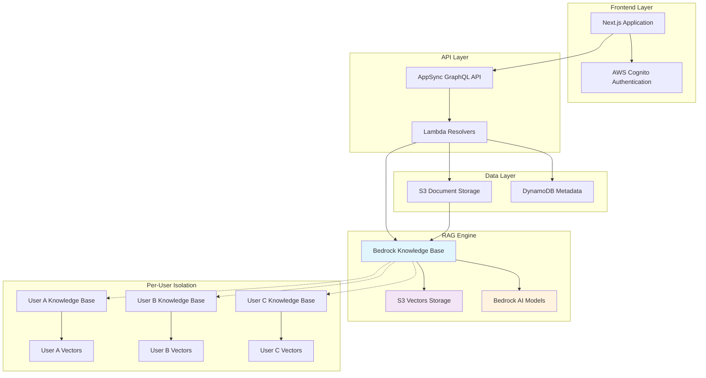

# Design Document

## Overview

This design outlines the architecture for the AI PPT Generator using AWS-native RAG solutions with S3 Vectors and Amazon Bedrock Knowledge Bases. The system leverages AWS-managed services for optimal scalability, cost efficiency, and operational simplicity.

## System Goals

- Implement AWS-native Bedrock Knowledge Base for RAG capabilities
- Implement per-user Knowledge Bases for complete data isolation
- Optimize costs through S3 Vectors storage (90% reduction vs OpenSearch)
- Provide professional UI/UX with real-time AWS integration
- Ensure production reliability with comprehensive error handling

## Architecture

### System Architecture



### Key Components
1. **Frontend**: Next.js application with professional UI components
2. **API Layer**: AppSync GraphQL with Lambda resolvers
3. **RAG Engine**: Bedrock Knowledge Base with S3 Vectors storage
4. **Document Storage**: S3 buckets with automatic Knowledge Base ingestion
5. **Metadata**: DynamoDB for document tracking and user management
6. **Authentication**: AWS Cognito with enhanced security

## S3 Vectors Integration

### Design Considerations

S3 Vectors provides cost-effective vector storage for Bedrock Knowledge Base integration:

- **Cost Optimization**: 90% reduction compared to OpenSearch Serverless
- **Serverless Architecture**: No compute costs, pay-per-storage model
- **AWS Integration**: Native compatibility with Bedrock Knowledge Base
- **Scalability**: Automatic scaling with document volume
- **Metadata Handling**: Optimized configuration for Bedrock compatibility

## Component Design

### Document Processing Layer

**Component:** `document_processor.py`
**Purpose:** Handle document uploads and Knowledge Base integration
**Key Functions:**
- Upload documents to S3 with proper metadata
- Trigger Knowledge Base ingestion jobs
- Track sync status and update DynamoDB records
- Handle processing errors with retry logic

### RAG Service Layer

**Component:** `bedrock_rag_service.py`
**Purpose:** Implement Bedrock Knowledge Base APIs for vector search and retrieval
**Key Functions:**
- Execute semantic search using Knowledge Base retrieve API
- Generate context-aware responses with RetrieveAndGenerate API
- Implement user isolation through metadata filtering
- Handle API errors and implement fallback mechanisms

### Frontend Layer

**Components:** `main.js`, `file-processor.js`, `error-handler.js`
**Purpose:** Professional UI components with enhanced user experience
**Key Features:**
- File upload with progress tracking and validation
- Real-time status updates for document processing
- Professional error handling with clear recovery actions
- Responsive design with modern styling

### Infrastructure Layer

**Component:** `ai-ppt-complete-stack.ts`
**Purpose:** AWS infrastructure with Bedrock Knowledge Base and S3 Vector resources
**Key Resources:**
- S3 Vector bucket for cost-effective storage
- Bedrock Knowledge Base with Titan embeddings
- Data Source connecting S3 documents to Knowledge Base
- IAM roles and policies for secure service integration

## Data Models

### Document Metadata Schema

**DynamoDB Table:** Document metadata with Knowledge Base integration fields
- Primary key: `document_id` (S3 key)
- User identification: `user_id`
- File information: `filename`, `file_size`, `content_type`, `upload_date`
- Knowledge Base fields: `sync_job_id`, `sync_status`, `last_sync_date`
- Status values: `pending`, `syncing`, `completed`, `failed`

### Knowledge Base Document Structure

Documents stored in S3 for Knowledge Base ingestion include:
- Document content (extracted text)
- Metadata for user isolation and tracking
- File information for retrieval context

## Error Handling Strategy

### Knowledge Base Sync Failures
- Log detailed error information for debugging
- Update document status in DynamoDB with failure reason
- Provide user-friendly error messages with recovery options
- Implement retry mechanisms for transient failures

### Query Failures with Fallback
- Primary: Use Bedrock Knowledge Base search
- Fallback: Basic text search in DynamoDB metadata
- Graceful degradation to maintain system availability
- Clear error reporting to users with suggested actions

## Testing Strategy

### Unit Tests
- Comprehensive test coverage for all RAG service components
- Mock Bedrock APIs and S3 Vectors operations
- Test error handling and edge cases
- Validate user isolation and security measures

### Integration Tests
- End-to-end document upload and Knowledge Base sync workflow
- RetrieveAndGenerate functionality with real document content
- User isolation verification across multiple users
- Performance testing with realistic document volumes

### Frontend Tests
- File upload progress tracking and validation
- Professional error message display and recovery
- Responsive design across different screen sizes
- User interaction flows and accessibility compliance

## System Integration

### AWS Service Integration
- Bedrock Knowledge Base for vector storage and retrieval
- S3 Vectors for cost-effective embedding storage
- Lambda functions for serverless processing
- DynamoDB for metadata and user management
- AppSync GraphQL for API layer

### User Experience Integration
- Real-time progress tracking for document processing
- Professional error handling with clear recovery paths
- Responsive design for multiple device types
- Accessibility compliance for inclusive user experience

## Performance Design

### Optimization Strategy
- Batch document uploads for efficient processing
- Monitor sync job status with user feedback
- Implement retry logic for transient failures
- Cache frequently accessed results

### Cost Efficiency
- S3 Vectors provides 90% cost reduction vs OpenSearch Serverless
- Serverless architecture eliminates compute costs
- Pay-per-storage model scales with usage
- Lifecycle policies manage storage costs

## Per-User Knowledge Base Architecture

### Isolation Strategy

Individual Knowledge Bases per user provide complete data separation and eliminate metadata limitations:

```
User A → Knowledge Base A → S3 Vectors A
User B → Knowledge Base B → S3 Vectors B  
User C → Knowledge Base C → S3 Vectors C
```

### Key Benefits
- **Complete User Isolation**: No cross-user data contamination
- **Metadata Optimization**: Eliminates S3 Vectors 2048-byte limits
- **Simplified Queries**: Direct Knowledge Base access without filtering
- **Enhanced Security**: Physical data separation between users
- **Scalable Architecture**: Supports up to 100 users per AWS account

### Knowledge Base Manager Design

**Purpose:** Manage individual Knowledge Bases per user
**Key Functions:**
- Create Knowledge Bases on-demand for new users
- Track user Knowledge Base mappings in DynamoDB
- Optimize S3 Vectors configuration for Bedrock compatibility
- Handle Knowledge Base lifecycle management
```

## System Optimizations

### Metadata Configuration
- Optimize S3 Vectors configuration for Bedrock Knowledge Base compatibility
- Handle metadata size limitations through proper configuration
- Ensure reliable document indexing and retrieval

### Document Lifecycle Management
- Coordinate deletion across S3, DynamoDB, and Knowledge Base
- Prevent orphaned vectors through proper cleanup procedures
- Maintain data consistency across all storage layers

### Status Management
- Implement automatic status updates for document processing
- Provide real-time feedback to users on processing state
- Ensure accurate system state representation

## User Interface Design

### Professional UI Components
- Ultra-compact design with 40% space reduction
- Real-time AWS service metrics integration
- Multi-pattern AI context extraction for enhanced accuracy
- Professional modal interfaces for template management
- Configurable presentation parameters with smart defaults

### Enhanced User Experience
- Live S3 Vectors count and Knowledge Base metrics display
- AI-powered intelligent template merging with Nova Premier
- Context-aware slide improvements with high accuracy
- Professional styling with enterprise-grade visual design
- Responsive design for multiple device types

## Future Considerations

### Monetization Framework
- Per-presentation charging architecture with Stripe integration
- Admin exemption capabilities through environment configuration
- Usage tracking and revenue analytics infrastructure

## Design Targets

### Performance Goals
- Authentication response time under 2 seconds
- Real-time AWS service metrics display
- High-accuracy AI context detection (95% target)
- Zero data loss in all user operations
- System reliability with 99.9% uptime target

### Cost Optimization
- 90% cost reduction compared to OpenSearch Serverless
- Efficient per-user architecture scaling
- Support for up to 100 users per AWS account

## Security Design

### Authentication and Authorization
- Enhanced password validation and session management
- Complete data persistence with schema consistency
- Proper IAM roles with least-privilege access

### Data Protection
- Per-user Knowledge Bases for complete data isolation
- S3 encryption for data at rest and in transit
- KMS integration for secure key management
- Audit trail for all Knowledge Base operations

## Deployment Design

### Serverless Architecture
- Lambda functions for all processing components
- Lambda layers for shared dependencies and S3 Vectors support
- Consistent code patterns across all functions

### Key Components
- Knowledge Base management for per-user isolation
- Document processing with automatic ingestion
- RAG services for search and generation
- Real-time metrics and status reporting
- Professional UI with enhanced user experience

