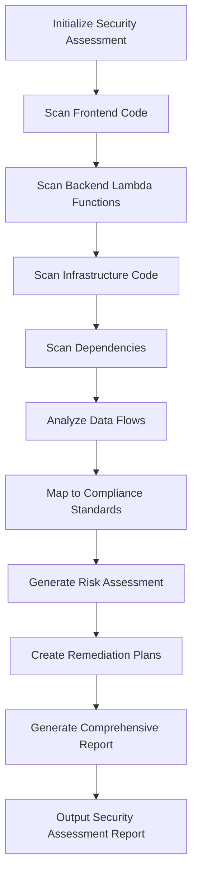

# Security Vulnerability Assessment Design

## Overview

The Security Vulnerability Assessment system is designed as a comprehensive, non-invasive security analysis framework that evaluates the entire AI PPT Generator codebase for vulnerabilities, compliance gaps, and deployment risks. The system generates detailed markdown reports with prioritized findings and actionable remediation plans, following industry standards including OWASP, NIST, AWS Well-Architected Framework, and compliance requirements.

## Architecture

### Assessment Engine Architecture

```
Security Assessment System
├── Static Code Analysis Engine
│   ├── Frontend Security Scanner (React/Next.js)
│   ├── Backend Security Scanner (Python/Lambda)
│   ├── Infrastructure Security Scanner (CDK/TypeScript)
│   └── Configuration Security Scanner
├── Dependency Vulnerability Scanner
│   ├── NPM Vulnerability Database Integration
│   ├── Python Security Advisory Integration
│   ├── CDK Dependency Scanner
│   └── License Compliance Checker
├── Data Flow Security Analyzer
│   ├── PII Detection Engine
│   ├── Authentication Flow Analyzer
│   ├── API Security Evaluator
│   └── Multi-tenant Isolation Checker
├── Compliance Mapping Engine
│   ├── OWASP Top 10 Mapper
│   ├── NIST Framework Evaluator
│   ├── AWS Security Best Practices Checker
│   └── Regulatory Compliance Assessor
└── Report Generation Engine
    ├── Markdown Report Generator
    ├── Risk Prioritization Engine
    ├── Remediation Plan Generator
    └── Security Metrics Calculator
```

### Security Scanning Workflow



## Components and Interfaces

### 1. Static Code Analysis Engine

**Frontend Security Scanner**
- **Purpose**: Analyze React/Next.js components for client-side vulnerabilities
- **Scope**: `frontend/src/` directory and webpack configuration
- **Detection Patterns**:
  - XSS vulnerabilities in JSX rendering
  - Unsafe `dangerouslySetInnerHTML` usage
  - Client-side authentication token exposure
  - Insecure localStorage/sessionStorage usage
  - CSRF vulnerability patterns
  - Input validation bypasses

**Backend Security Scanner**
- **Purpose**: Evaluate Lambda functions for server-side vulnerabilities
- **Scope**: `backend/lambda_functions/` directory
- **Detection Patterns**:
  - SQL injection in DynamoDB queries
  - Command injection in document processing
  - Path traversal vulnerabilities
  - Insecure deserialization
  - Information disclosure in error handling
  - Insufficient input validation

**Infrastructure Security Scanner**
- **Purpose**: Assess CDK configurations for security misconfigurations
- **Scope**: `infrastructure/lib/` directory
- **Detection Patterns**:
  - Overprivileged IAM policies
  - Public S3 bucket configurations
  - Unencrypted data storage
  - Missing security groups
  - Insecure API Gateway configurations
  - Weak Cognito settings

### 2. Dependency Vulnerability Scanner

**NPM Vulnerability Integration**
- **Data Sources**: 
  - National Vulnerability Database (NVD)
  - GitHub Security Advisories
  - Snyk Vulnerability Database
  - npm audit API
- **Analysis Scope**: `package.json`, `package-lock.json` files
- **Output**: CVE mappings, severity scores, update recommendations

**Python Security Advisory Integration**
- **Data Sources**:
  - Python Security Advisory Database
  - Safety DB
  - PyUp.io Security Database
- **Analysis Scope**: `requirements.txt` files
- **Output**: Security advisories, vulnerable package versions

### 3. Data Flow Security Analyzer

**PII Detection Engine**
- **Analysis Patterns**:
  - Email address handling in authentication flows
  - Document content processing and storage
  - User profile data management
  - Payment information handling (Stripe integration)
- **Privacy Compliance**: GDPR, CCPA, HIPAA considerations

**Authentication Flow Analyzer**
- **Security Checks**:
  - JWT token handling and validation
  - Session management security
  - Password policy enforcement
  - Multi-factor authentication gaps
  - OAuth flow security

### 4. Compliance Mapping Engine

**OWASP Top 10 Mapper**
- **A01 - Broken Access Control**: IAM policy analysis, API authorization checks
- **A02 - Cryptographic Failures**: Encryption at rest/transit analysis
- **A03 - Injection**: SQL injection, command injection detection
- **A04 - Insecure Design**: Architecture security review
- **A05 - Security Misconfiguration**: Infrastructure configuration analysis
- **A06 - Vulnerable Components**: Dependency vulnerability scanning
- **A07 - Authentication Failures**: Authentication flow security analysis
- **A08 - Software Integrity Failures**: Supply chain security assessment
- **A09 - Logging Failures**: Security logging and monitoring evaluation
- **A10 - Server-Side Request Forgery**: SSRF vulnerability detection

**AWS Well-Architected Security Pillar**
- **Identity and Access Management**: IAM policy evaluation
- **Detective Controls**: CloudWatch logging and monitoring assessment
- **Infrastructure Protection**: Network security and VPC configuration
- **Data Protection**: Encryption and data handling analysis
- **Incident Response**: Security incident preparation evaluation

## Error Handling

### Scanning Error Management

**File Access Errors**
- **Strategy**: Graceful degradation with partial analysis
- **Logging**: Detailed error logs for debugging
- **Reporting**: Clear indication of incomplete analysis areas

**API Integration Failures**
- **Fallback**: Local vulnerability databases when APIs are unavailable
- **Retry Logic**: Exponential backoff for transient failures
- **Timeout Handling**: Configurable timeouts for external service calls

**Large File Handling**
- **Memory Management**: Streaming analysis for large files
- **Progress Tracking**: Real-time progress reporting
- **Resource Limits**: Configurable memory and time limits

### Report Generation Error Handling

**Template Rendering Errors**
- **Validation**: Pre-validation of report data structures
- **Fallback Templates**: Simple text-based reports when markdown fails
- **Error Recovery**: Partial report generation with error annotations

## Testing Strategy

### Unit Testing

**Scanner Component Tests**
```javascript
// Example test structure
describe('Frontend Security Scanner', () => {
  test('detects XSS vulnerabilities in JSX', () => {
    const code = `<div dangerouslySetInnerHTML={{__html: userInput}} />`;
    const vulnerabilities = frontendScanner.scan(code);
    expect(vulnerabilities).toContain('XSS_DANGEROUS_HTML');
  });
});
```

**Dependency Scanner Tests**
```python
# Example test structure
def test_npm_vulnerability_detection():
    package_json = {"dependencies": {"lodash": "4.17.15"}}
    vulnerabilities = dependency_scanner.scan_npm(package_json)
    assert any(vuln.cve == "CVE-2020-8203" for vuln in vulnerabilities)
```

### Integration Testing

**End-to-End Security Assessment**
- **Test Data**: Synthetic vulnerable code samples
- **Expected Outputs**: Known vulnerability patterns
- **Report Validation**: Complete report generation workflow

**Compliance Mapping Tests**
- **OWASP Mapping**: Verify correct categorization of vulnerabilities
- **Standards Alignment**: Ensure compliance framework mappings are accurate

### Performance Testing

**Large Codebase Handling**
- **Memory Usage**: Monitor memory consumption during analysis
- **Processing Time**: Benchmark scanning performance
- **Scalability**: Test with varying codebase sizes

## Security Considerations

### Assessment Tool Security

**Data Privacy**
- **No Code Modification**: Read-only analysis ensures code integrity
- **Local Processing**: All analysis performed locally, no external code transmission
- **Sensitive Data Handling**: Secure handling of detected secrets and credentials

**Tool Chain Security**
- **Dependency Verification**: Verify integrity of security scanning tools
- **Update Management**: Secure update process for vulnerability databases
- **Access Controls**: Appropriate permissions for assessment execution

### Report Security

**Sensitive Information Protection**
- **Credential Redaction**: Automatic redaction of detected secrets
- **Path Sanitization**: Remove absolute paths that might reveal system information
- **Access Control Recommendations**: Secure storage and distribution of reports

## Implementation Phases

### Phase 1: Core Scanning Infrastructure
- Static code analysis engine implementation
- Basic vulnerability detection patterns
- Simple markdown report generation

### Phase 2: Dependency and Compliance Integration
- Vulnerability database integration
- OWASP Top 10 mapping implementation
- Enhanced report formatting

### Phase 3: Advanced Analysis and Compliance
- Data flow security analysis
- Comprehensive compliance mapping
- Risk prioritization and remediation planning

### Phase 4: Automation and Integration
- CI/CD pipeline integration capabilities
- Automated report distribution
- Continuous security monitoring framework

## Output Specifications

### Security Assessment Report Structure

```markdown
# Security Vulnerability Assessment Report
## Executive Summary
## Critical Findings
## High Priority Vulnerabilities
## Medium Priority Issues
## Low Priority Observations
## Compliance Assessment
## Remediation Roadmap
## Security Metrics
## Appendices
```

### Remediation Plan Format

```markdown
## Vulnerability: [Name]
- **Severity**: Critical/High/Medium/Low
- **OWASP Category**: [Category]
- **CWE ID**: [Common Weakness Enumeration ID]
- **Description**: [Detailed description]
- **Impact**: [Business and technical impact]
- **Remediation Steps**: [Specific implementation steps]
- **Timeline**: [Recommended fix timeline]
- **Verification**: [How to verify the fix]
```

This design provides a comprehensive framework for security assessment that generates actionable reports without modifying any existing code, following industry best practices and compliance standards.