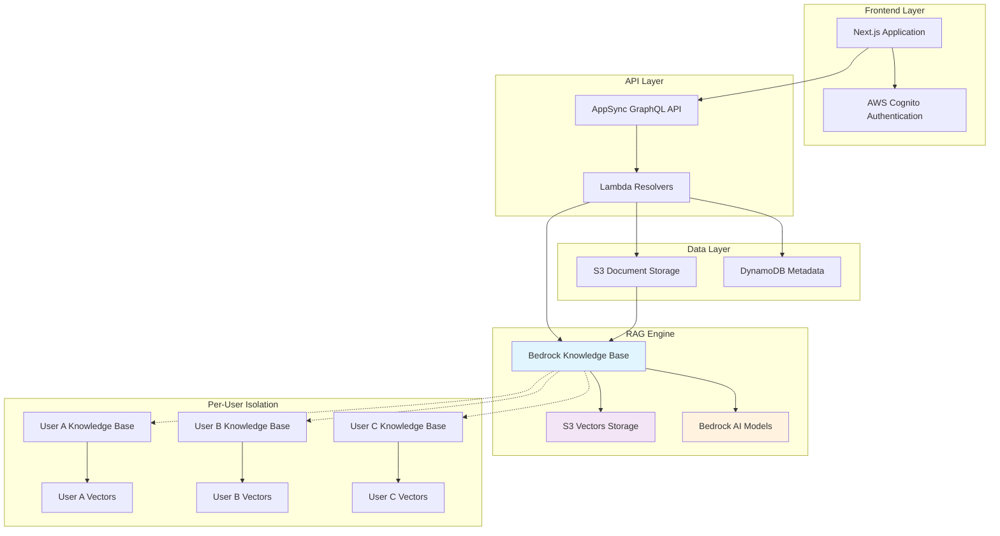

# From Crisis to Revolutionary Development: Building Production AI with Kiro

*How a presentation emergency inspired a new approach to AI-powered development*

## The Crisis That Started Everything

Picture this: 15 minutes before a major presentation, your file is corrupted. Hundreds of developers are waiting. Most would panic.

Donnie Prakoso, Principal Developer Advocate at AWS, [turned to Amazon Q CLI](https://www.linkedin.com/feed/update/urn:li:activity:7338386803713810432/). His methodical approach - requirements, task-based workflows, MCP tools - saved the day. But his key insight changed everything: "It's not about the AI tool itself, but how you integrate it into your workflow."

This real life scenario inspired me with the idea to build a full self-service app for AI Presentation Generator by using Kiro and leveraging these key capabilties:

- Serverless AWS architecture with Bedrock Models
- Real-time document processing with Bedrock Knowledge Base  
- Per-user data isolation for enterprise security
- S3 Vectors integration (no Amazon OpenSearch Serverless) for cost-optimized storage 
- React frontend with modern Amplify v6 authentication
- CDK infrastructure scaling from prototype to production


## The Kiro Transformation

Remembering the workflow-first approach, I opened Kiro: "Help me build an AI-based Presentation Generator system with above key capabilities that can help with edit slides, geneate content, export the presentation to Marp, Reveal.js or HTML formats"

What happened next was unlike any coding experience I'd had.

Kiro didn't give generic answers. It broke down complexity into manageable tasks, analyzed my specific architecture needs with an accurate design, and hooked me to **spec-driven development**.


## The Spec-Driven Revolution

Instead of one massive requirements document, over the development cycle, I created 5 different modular specs:

- **AWS-Native RAG spec**: Core system with Bedrock and S3 Vectors
- **System Fixes spec**: Surgical improvements without breaking production
- **UI Enhancement spec**: Professional interface without backend risk  
- **Blog Platform spec**: Content creation system (generating this post)
- **Security Vulnerability Assessment specs**: Full assessment of the system for any vulenrabilities to make sure the app is secure and production ready

Each spec operated independently. I could iterate fearlessly on complex use-cases separately and one-after-other.

## Building Production AI: The Technical Journey

### The S3 Vectors Breakthrough

When I mentioned vector storage costs, Kiro's MCP integration with my configured awslabs aws-knowledge-mcp-server immediately suggested S3 Vectors - a preview service yet fully searchable with the MCP server with all examples and ready to use code from AWS blog posts and official AWS documentation:

"S3 Vectors can reduce costs by 90% compared to OpenSearch Serverless."

The implementation was game-changing. For instance, this single line saved hours of debugging. 


```python
s3vectors.create_index(
    vectorBucketName=bucket_name,
    indexName=index_name,
    dimension=1024,
    distanceMetric="cosine",
    dataType="float32",
    metadataConfiguration={
        "nonFilterableMetadataKeys": ["AMAZON_BEDROCK_TEXT"]  # CRITICAL
    }
)
```

The result: 90% cost reduction while maintaining full functionality.

I asked Kiro about CDK's current lack of native support for S3 Vectors (which would require implementing a Custom Lambda Resource), and we ended up with the optimal architectural decision  to handle vector index creation programmatically at runtime using the boto3 SDK during document ingestion, ensuring future compatibility and per-user isolation.


### Per-User Architecture Innovation

Kiro proposed something I hadn't considered - per-user Knowledge Bases:

```
Traditional: Shared KB → Complex filtering → Performance issues
Innovation: User A → KB A, User B → KB B → Perfect isolation
```

This architecture eliminated:
- Complex metadata filtering
- S3 Vectors 2KB metadata limits  
- Cross-user data contamination
- Query performance bottlenecks


### System Architecture




### Complete CDK Infrastructure Generation

Instead of generic boilerplate, Kiro generated production-ready infrastructure:

```typescript
// Generated by Kiro - Complete serverless stack
const knowledgeBaseRole = new iam.Role(this, 'KnowledgeBaseRole', {
  assumedBy: new iam.ServicePrincipal('bedrock.amazonaws.com'),
  inlinePolicies: {
    S3VectorsPolicy: new iam.PolicyDocument({
      statements: [
        new iam.PolicyStatement({
          actions: [
            's3vectors:CreateVectorBucket',
            's3vectors:GetIndex',  // Often missed, critical for debugging
            's3vectors:QueryVectors'
          ],
          resources: ['*'],
        }),
      ],
    }),
  },
});
```

The code (thanks to the awslabs mcp server) included the often-missed `s3vectors:GetIndex` permission that would have taken hours to debug.

### Sophisticated Lambda Functions

Kiro generated complete systems with proper error handling:

```python
class BedrockRAGService:
    def search_similar_content(self, query: str, user_id: str, top_k: int = 5):
        try:
            user_kb_info = self._get_user_kb_info(user_id)
            if not user_kb_info:
                raise ValueError(f"No Knowledge Base found for user {user_id}")
            
            response = self.bedrock_agent_runtime.retrieve(
                knowledgeBaseId=user_kb_info['knowledge_base_id'],
                retrievalQuery={'text': query},
                retrievalConfiguration={
                    'vectorSearchConfiguration': {'numberOfResults': top_k}
                }
            )
            
            return self._format_search_results(response)
            
        except Exception as e:
            logger.error(f"RAG search failed: {str(e)}")
            return {'error': 'Search temporarily unavailable'}
```

The code included timeout handling, user-specific routing, and graceful error recovery - patterns that would have taken days to implement properly.

## The Production Architecture

The application runs on:

**Frontend**: Next.js 15.4.5 + React 19.1.0, AWS Amplify v6, Webpack 5 (~170 KiB bundle)

**Backend**: Python 3.11 Lambda functions with Bedrock Knowledge Base integration

**AI Services**: Amazon Nova Pro + Titan embeddings, S3 Vectors storage

**Data Layer**: DynamoDB + S3 with per-user isolation

**Cost Optimization**: 90% reduction in vector storage costs vs traditional approaches

## The Velocity Impact

**Traditional Approach (Estimated):**
- Feature planning: 2-3 weeks
- Cross-system coordination: 1-2 weeks
- Implementation with risk mitigation: 4-6 weeks  
- Testing and validation: 2-3 weeks
- **Total: 9-14 weeks per feature**

**Spec-Driven Approach (Actual):**
- Focused spec creation: 2-3 days
- Independent implementation: 1-2 days
- Isolated testing: 3-5 days
- **Total: 1-2 weeks**

## Beyond Code Generation

Kiro understood broader context:
- **User Experience**: Suggested async processing to avoid wait times
- **Cost Optimization**: Recommended S3 Vectors for 90% savings
- **Security**: Implemented per-user isolation without being asked
- **Scalability**: Designed for 100 users per AWS account with clear scaling paths

## The Automation Revolution

Kiro helped create agent hooks that eliminated entire bug categories:

**CDK Synth Hook**: Automatically validates infrastructure changes
**README Spell Check**: Maintains documentation quality
**Test Automation**: Runs comprehensive validation on every change

These hooks transformed development from reactive debugging to proactive quality assurance.

## The Compound Effect

Spec-driven development changed how I approach complex systems:

**Before**: "How can I add this feature without breaking anything?"
**After**: "What focused spec addresses this specific concern?"

**Before**: "This change might affect multiple systems."
**After**: "This spec targets exactly one area."

The spec-driven development eliminated the fear of changing complex production systems.

## Real-World Results

**Milestone 1**: AWS-Native RAG spec → Production deployment with S3 Vectors
**Milestone 2**: System Fixes spec → Critical issues resolved without disruption
**Milestone 3**: UI Enhancement spec → Professional interface without backend changes
**Milestone 4**: Blog Platform spec → Content creation system for sharing this story
**Milestone 5**: Security Assessment spec → Full vulnerability assessment of the system

Each spec operated independently, allowing rapid iteration without fear of breaking existing functionality.

## The Future of AI Development

This approach scales beyond the AI PPT Generator:

**Enterprise Applications**: Core business logic, UI enhancement, performance optimization as separate specs

**Microservices**: Service foundation, API enhancement, monitoring as isolated concerns

**AI Systems**: Model integration, data processing, user interface as modular specifications

## Key Takeaways

1. **Workflow-first thinking** beats tool-first approaches
2. **Spec-driven development** enables fearless iteration on complex systems
3. **AI assistants excel** at architectural guidance within structured processes  
4. **Modular specs prevent** technical debt accumulation
5. **Per-user architectures** solve isolation and scaling challenges elegantly

## Try It Yourself

The complete code is available at [github.com/awsdataarchitect/ai-ppt-generator](https://github.com/awsdataarchitect/ai-ppt-generator) with detailed instructions for reproducing this spec-driven development approach.

The live AI PPT Generator showcases these techniques in production: https://main.d2ashs0ytllqag.amplifyapp.com

Experience how workflow-first AI development transforms complex AWS projects from chaotic research cycles into predictable, scalable methodologies.

The future of software development isn't about AI replacing developers - it's about integrating AI into workflows that amplify human creativity and eliminate the fear of building complex systems.
